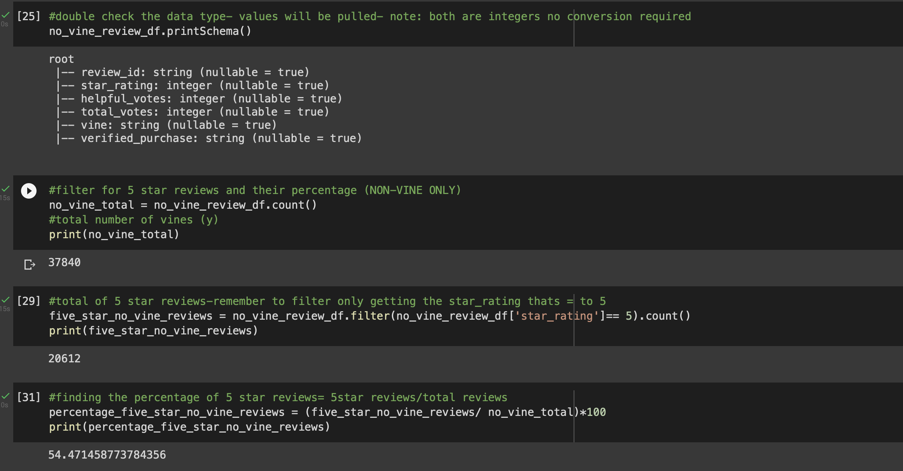
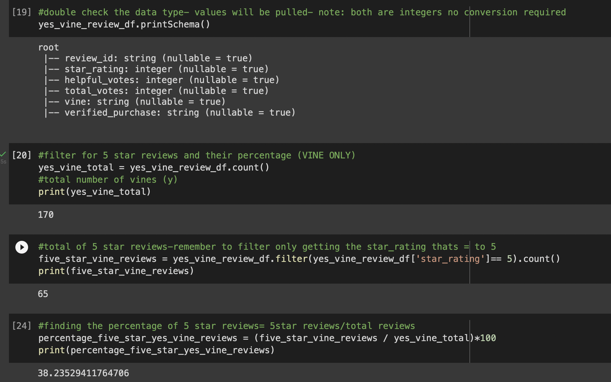
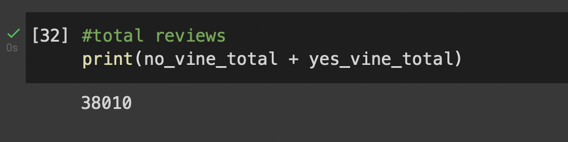

# Amazon_Vine_Analysis

## Overview

The purpose of this project was to perform an analysis on Amazon reviews: since some of the reviews were a part of a vine program (paid reviews) and others were not. In the vine program, provided by Amazon, the reviews were compensated, bring the question of: is there bias in these product reviews? 

There were multiple datasets to choose from varying from e-books to music, digital content, home goods, and so one. The selected data set was pet supplies, as its important to have good quality goods for pets. When looking at the best supplies to get for your pet, its best to have products that are actually beneficial for you and your pet, rather than products that were highly rated and actually are not that great. 

In order to dive in and provide an analysis and evaluation on the dataset, the S3 bucket will need to be read into google colab using PySpark, where it could be cleaned and filtered through for the necessary information. After the data’s been cleaned, it’ll then be imported into postgresSQL where its then exported into a CSV (optional). After the data’s been cleaned and broken up into their new categories, diving into the reviews to dissect and analyze the information to see if there is bias. 

## Results 

•	The non-vine members had a total of 37,840 total reviews. 
•	The total of 5-star reviews given by non- vine members was total of 20,612.
•	54.47% of 5-star reviews were given by non- vine members 

•	The vine members had 170 total reviews, 
•	The total 5-star reviews given by vine members were 65. 
•	38.23% of 5-star reviews were given by vine members 

## Summary

When looking at the cleaned and filtered data, the vine members do not show any bias towards the data. The total reviews for pet supplies were 38,010 and only 170 of those votes were vine members. When looking at the amount of vine members only 38.2% were 5-star reviews. The total 5- star reviews are 20,677 and of those only 65 were from vine members. The vast majority of the 5-star reviews were given by the non-vine members. It’s safe to say, there is little to no bias in the dataset, as the vine members don’t heavily impact the star ratings of the pet supply products. 

